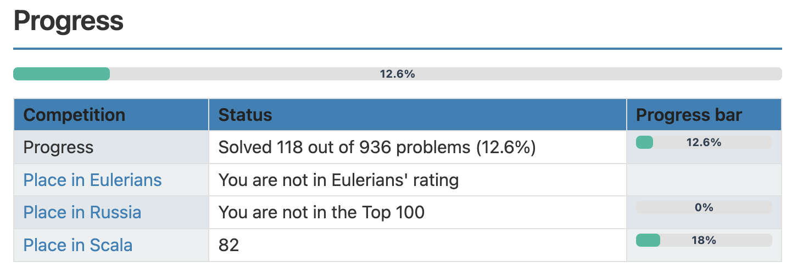
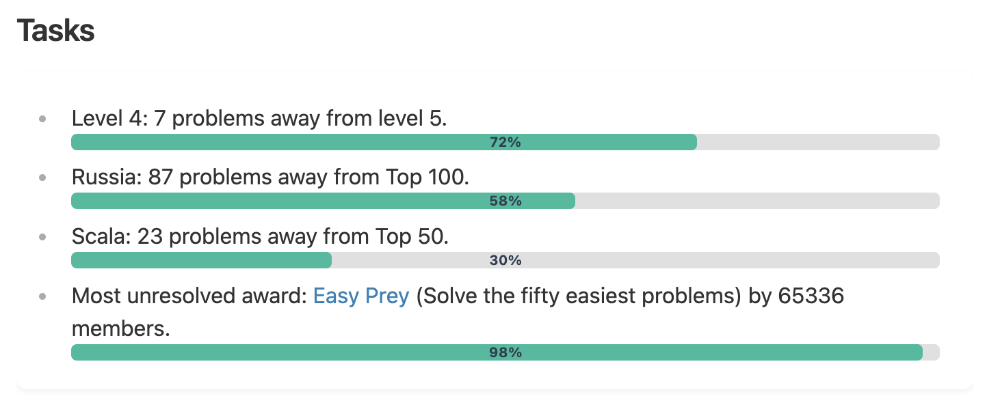

# Project Euler Stats

This repository contains an Obsidian plugin that allows users to automatically fetch and display statistics
from the [Project Euler](https://projecteuler.net/) website.
The plugin integrates seamlessly with Obsidian, providing a convenient way
to track your Project Euler problem-solving progress directly within your personal knowledge base.

This plugin is perfect for math and programming enthusiasts
who want to track their Project Euler achievements directly in Obsidian,
integrating them with other knowledge and notes.

---

## Features

1. **Profile Information**:

	- Displays your Project Euler account details, including username, alias, location,
	  programming language, level, and number of solved problems.

2. **Progress Overview**:

	- Shows your overall progress, including the percentage of problems solved
	  and your rankings in global, regional, and language-specific leaderboards.

3. **Tasks**:

	- Lists your current tasks, such as the number of problems remaining
	  to reach the next level or improve your rankings.

4. **Awards**:

	- Displays your progress toward earning Project Euler awards, including both completed and uncompleted awards.

5. **Friends**:
	- Compares your progress with your friends on Project Euler.

---

## Installation

1. **Install the Plugin**:

	- Open Obsidian.
	- Go to **Settings** → **Community plugins**.
	- Click **Browse** and search for "Project Euler Stats".
	- Install and enable the plugin.

2. **Configure Your Project Euler Settings**:
	- After enabling the plugin, go to **Settings** → **Project Euler Stats**.
	- Enter your `SessionId` and `Keep-Alive` cookie values in the provided fields.
	- Save the settings.

---

## Usage

To display your Project Euler progress, use the following code block in your Obsidian note:

````markdown
```euler-stats

```
````

This will generate a document with your Project Euler statistics, including your profile, progress, tasks, awards, and more.

### Example


<br>

<br>


For more detailed information, please refer to [the documentation](https://artemkorsakov.github.io/project-euler-obsidian-plugin/).

### Requirements:

- Obsidian version 0.15.0 or higher.
- A Project Euler account.

## Troubleshooting

- **HTTP error!**:
	- Ensure your `SessionId` and `Keep-Alive` cookie values is correctly configured in the plugin settings.
	- Update your `SessionId` and `Keep-Alive` cookie values.

### License:

This plugin is distributed under the MIT License. You are free to use, modify, and distribute it.

### Contributing:

We welcome contributions from the community! If you'd like to add new features, fix bugs, or improve documentation,
feel free to create a pull request or open an issue in the repository.
