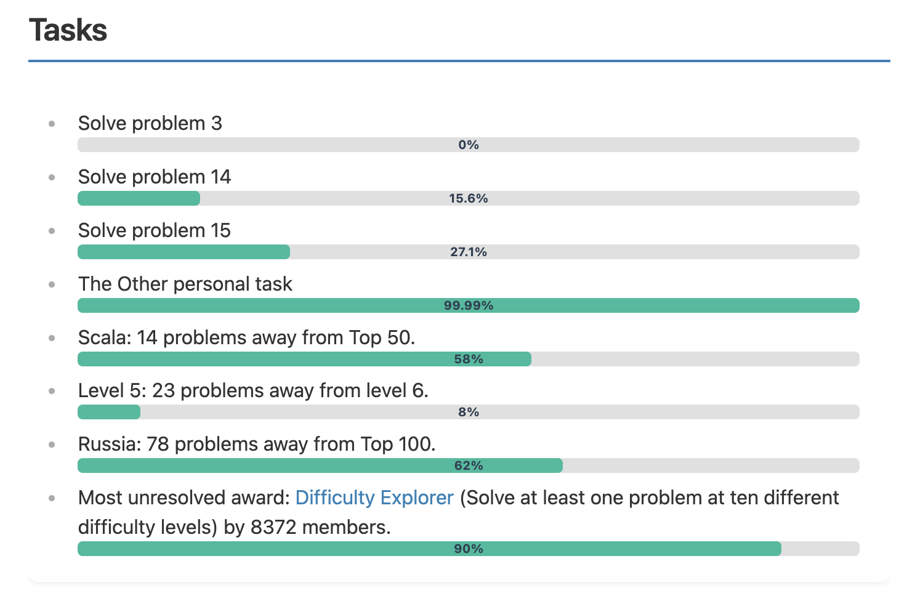

# Project Euler Stats

Welcome to the docs for the Project Euler Stats plugin for Obsidian!

This plugin allows you to seamlessly integrate and display [Project Euler][projecteuler]
profile statistics directly within your Obsidian notes.
**Project Euler Stats** allows users to track their progress in solving problems on the Project Euler platform.
By using a simple command, users can generate a detailed profile that displays their profile, progress,
tasks, awards, and friends' rankings.

---

## Features

1. **Profile Information**:

	- Displays your Project Euler account details, including username, alias, location,
	  programming language, level, and number of solved problems.

2. **Progress Overview**:

	- Shows your overall progress, including the percentage of problems solved
	  and your rankings in global, regional, and language-specific leaderboards.

3. **Tasks**:

	- Lists your current tasks, such as the number of problems remaining
	  to reach the next level or improve your rankings.

4. **Awards**:

	- Displays your progress toward earning Project Euler awards, including both completed and uncompleted awards.

5. **Friends**:
	- Compares your progress with your friends on Project Euler.

---

## Installation

1. **Install the Plugin**:

	- Open Obsidian.
	- Go to **Settings** → **Community plugins**.
	- Click **Browse** and search for "Project Euler Stats".
	- Install and enable the plugin.

2. **Configure Your Project Euler Settings**:
	- After enabling the plugin, go to **Settings** → **Project Euler Stats**.
	- Enter your `SessionId` and `Keep-Alive` cookie values in the provided fields.
	- Save the settings.

> See below section "How to extract cookies?"

---

## Usage

To display your Project Euler progress, use the following code block in your Obsidian note:

````markdown
```euler-stats

```
````

This will generate a document with your Project Euler statistics, including your profile, progress, tasks, awards, and more.

---

## Sections

### Profile

This section displays your account information, including:

- **Account**: Your Project Euler username.
- **Alias**: Your display name.
- **Location**: Your geographical location.
- **Language**: The programming language you are using.
- **Level**: Your current level in Project Euler.
- **Solved**: The number of problems you have solved.


### Progress

This section provides an overview of your progress:

- **Progress**: Shows how many problems you have solved out of the total available, along with the percentage.
- **Ranking**: Displays your current ranking in various categories, such as Eulerians, by location, and by language.


### Tasks

Here, you can see your current tasks and how many problems you need to solve to reach the next level or ranking.


### Personal tasks

You can add and track your personal tasks using the `euler-stats` code block format.
This allows you to monitor your progress on specific Project Euler problems directly or any another specific task
in your Obsidian notes.

````
```euler-stats
Solve problem 3; 0%
Solve problem 14; 15.6%
Solve problem 15; 27.1%
The Other personal task; 99.99%
```
````

Each task should be written in the following format:

```
<task>; <progress>%
```

- **`<task>`**: Your personal task.
- **`<progress>`**: The percentage of progress you have made on the problem (e.g., `0%`, `15.6%`, `100%`).

Personal tasks will be added before "standard" ones in the order they are declared.



### Location progress

This section provides an overview of your ranking in the **Location rating** on Project Euler.
Currently, this account is **not in the Top 100**, with **118 problems solved**.
The table below breaks down the number of problems required to reach higher ranks,
such as Top 100, Top 50, Top 25, Top 10, Top 5, and Top 1,
along with the number of problems remaining to achieve each milestone.

This section helps you track your progress and set goals for climbing the ranks in the Location leaderboard.


### Language progress

This section highlights your ranking in the **Language rating** on Project Euler.
This account is currently in **82nd place**, with **118 problems solved**.
The table outlines the number of problems needed to advance to higher ranks,
such as Top 50, Top 25, Top 10, Top 5, and Top 1,
along with the remaining problems required for each milestone.

This section helps you track your progress and set goals for climbing the ranks in the Language leaderboard.


### Level progress

This section provides an overview of your **level progression** on Project Euler.
It displays your current level, the number of problems you've solved,
and how close you are to reaching the next levels.
Additionally, it shows how many members have achieved each level,
giving you a sense of your standing within the community.

This section is designed to help you stay motivated and focused on your journey through Project Euler's levels.
Keep solving problems to climb higher and join the ranks of the top members!


### Awards

This section provides an overview of the **awards** you can earn on Project Euler.
Awards are divided into three categories: **Problem Solving Awards**, **Contributor Awards**, and **Forum Based Awards**.
Each award has a description, the number of members who have earned it, and a progress bar to track your progress.

This section helps you stay motivated by showcasing your achievements and highlighting areas for improvement.
Keep solving problems, contributing, and engaging with the community to unlock more awards!


### Friends

This section shows a leaderboard of your friends, including their ranks, usernames, solved problems, levels, and awards.


---

## Syncing with Project Euler

By default, the plugin uses data from the **local cache** to avoid overloading the Project Euler website.
This ensures faster access to your stats and reduces unnecessary requests to the server.

### How to Sync Data

To update your data with the latest information from Project Euler, follow these steps:

1. Run the command **`Project Euler Stats: Sync with Project Euler`**.

	- This command will fetch the latest data from the Project Euler website and update your local cache.

   

2. **Success Message**:

	- If the sync is successful, you will see a notification:  
	  **`Successfully synced with Project Euler.`**

3. **Error Handling**:
	- If the sync fails, it usually means that your session has expired.  
	  **What to do if this happens:**
		1. Go to the [Project Euler website][projecteuler] and log in.
		2. Check the values of your cookies:
			- `PHPSESSID`
			- `keep_alive`
		3. Update these values in the plugin's settings:
			- Open the plugin settings in Obsidian.
			- Replace the old `SessionId` and `Keep-Alive` values with the new ones.
		4. Run the sync command again.

### Example Workflow

1. You’ve solved a new problem on Project Euler and want to update your stats in Obsidian.
2. Run the **`Project Euler Stats: Sync with Project Euler`** command.
3. If successful, your stats will now show the updated progress.
4. If the sync fails, follow the steps above to update your session cookies and try again.

---

## How to extract cookies?

To retrieve cookies for a specific website from your browser, follow these steps:

### **Google Chrome**:

1. Open the website in Chrome.
2. Right-click anywhere on the page and select **Inspect** (or press `Ctrl+Shift+I` / `Cmd+Option+I`).
3. Go to the **Application** tab in the Developer Tools.
4. In the left sidebar, expand **Cookies** and select the website's domain.
5. You will see a list of cookies with their names and values.

### **Firefox**:

1. Open the website in Firefox.
2. Right-click anywhere on the page and select **Inspect Element** (or press `Ctrl+Shift+I` / `Cmd+Option+I`).
3. Go to the **Storage** tab in the Developer Tools.
4. Expand **Cookies** and select the website's domain.
5. The cookies and their values will be displayed.

### **Microsoft Edge**:

1. Open the website in Edge.
2. Right-click anywhere on the page and select **Inspect** (or press `Ctrl+Shift+I` / `Cmd+Option+I`).
3. Go to the **Application** tab in the Developer Tools.
4. Expand **Cookies** and select the website's domain.
5. View the cookies and their values.

### **Safari**:

1. Open Safari and go to the website.
2. Enable the **Develop** menu by going to **Safari** → **Preferences** → **Advanced** and checking **Show Develop menu in menu bar**.
3. From the **Develop** menu, select **Show Web Inspector** (or press `Cmd+Option+I`).
4. Go to the **Storage** tab and expand **Cookies** to view the website's cookies.

### **Using JavaScript**:

If you have access to the browser's console, you can retrieve cookies for the current site using JavaScript:

```javascript
document.cookie;
```

This will return a string of all cookies for the current domain.

### **Important Notes**:

- Cookies are domain-specific, so you can only access cookies for the site you are currently on.
- Some cookies may be marked as `HttpOnly`, meaning they cannot be accessed via JavaScript for security reasons.
- Always handle cookies responsibly and in compliance with privacy laws and regulations.

---

Here’s the translated and enhanced version of the troubleshooting documentation:

---

## Troubleshooting

### Common Issues and Solutions

#### **HTTP Error!**

If you encounter an HTTP error, follow these steps:

1. **Check Your Cookie Values**:

	- Ensure that your `SessionId` and `Keep-Alive` cookie values are correctly configured in the plugin settings.
	- To update these values:
		1. Log in to the [Project Euler website][projecteuler].
		2. Retrieve the latest `PHPSESSID` and `keep_alive` values from your browser's cookies.
		3. Update these values in the plugin settings in Obsidian.

2. **If the Issue Persists**:

	- Enable the **Obsidian Console** to gather more information about the error:
		1. Open Obsidian.
		2. Press `Ctrl+Shift+I` (Windows/Linux) or `Cmd+Option+I` (Mac) to open the Developer Tools.
		3. Navigate to the **Console** tab to view error messages.

3. **Report the Issue**:
	- If the problem persists, please report it on [GitHub][github]:
		1. Take a screenshot of the error message.
		2. Copy the error logs from the Obsidian Console.
		3. Open a new issue on the plugin’s GitHub repository and include:
			- A description of the problem.
			- The screenshot of the error message.
			- The error logs from the Console.

---

## Support

For issues or feature requests, please open an issue on the [GitHub repository][github].

---

Enjoy tracking your Project Euler progress directly in Obsidian! 🚀

[projecteuler]: https://projecteuler.net/
[github]: https://github.com/artemkorsakov/project-euler-stats/issues
